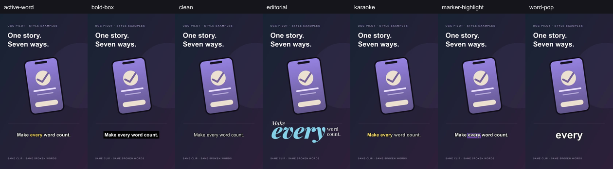

# Subtitle styles and saved-video finishing

Implemented October 7, 2026; included in the authorized complete release. See `release-2026-10-07.md` for release verification. Offline validation uses fixtures without paid transcription or publishing.

## User flow

Hook and Phone workflows share eight subtitle choices. Select a style to update the draft, then explicitly press **Play example** in the single player below the cards. Changing style resets the example. Playback pauses when its section/page is hidden or the player leaves the viewport. Examples never autoplay, including with reduced motion. Posters, loading feedback, errors, keyboard playback, and explicit retry are supported.

Under Create, **Upload** and **Creative Assets** select a ready, owned opening video, then **Continue to edit** opens finishing. The user may append a demo and its added audio, choose approved default background music, and enable subtitles. **Apply edits** saves a new derivative and preserves the source. Generate retains the current live composer, model settings and durable jobs. Scheduling uses the existing confirmation editor and saved derivative.

| ID | Label | Behavior | Renderer version |
| --- | --- | --- | --- |
| `clean` | Clean | Outlined phrases; default | `classic-v1` |
| `bold-box` | Bold box | Bold phrases on a dark box | `classic-v1` |
| `active-word` | Active word | Current word changes color | `classic-v1` |
| `editorial` | Editorial | Existing measured typography | `editorial-v1` |
| `word-pop` | Word pop | One large word; bounded 94–100% entrance | `word-pop-v1` |
| `karaoke` | Karaoke | Fixed phrase; progressive fill at real word times | `karaoke-v1` |
| `marker-highlight` | Marker highlight | Fixed phrase; background under active word | `marker-highlight-v1` |
| `serif-box` | Serif black box | Instrument Serif on black; whole words fade from grey to white | `serif-box-v2` |

`worker/src/subtitles/styles.ts` is the browser-safe registry used by the UI, request validation, recovery, standalone renderer, worker, and preview build. Unknown IDs fail closed. SQL repeats the IDs because it cannot import TypeScript; a regression test checks every registry ID and rejects malformed subtitle records atomically. Existing four renderer identities and legacy default Bottom remain available. Bottom, Middle, and Top use shared safe-area geometry.

## Rendering and recovery

All three new styles use the same ASS/FFmpeg path for previews and finished videos. Dynamic word bounds come from the complete shaped phrase in libass, including font, spacing, wrapping, and kerning. Word pop stays inside the safe area. Karaoke fills only during supplied word intervals and holds completed fill through short pauses. Marker clears its active background during a pause while retaining the phrase. Long pauses split phrases. Classics and Editorial retain their existing grouping/rendering paths.

The worker composes the full video and final mixed soundtrack first. Its transcription WAV derives from that soundtrack, including demo audio and optional background music. English-only subtitles support at most 60 seconds of the complete sequence. Measured duration/font checks precede paid transcription; no video is shortened to satisfy subtitle limits. Added audio can fade at the demo end, pad after one play, or repeat when explicitly selected.

Authenticated APIs accept owned asset IDs and a normalized draft. They reject caller-chosen owners, URLs, storage keys, output IDs, and fingerprints. An atomic receipt reserves one job and deterministic output. All selected media ownership is checked before download/provider work. Owner, source hash, duration, and provider policy bind durable transcription. Transcripts save before rendering/upload. Lost upload/finalization responses recover the same stored output. Cancellation reaches long media/provider operations, and SQL leases prevent stale workers from finalizing. An unresolved provider submission remains uncertain and requires reconciliation; it is never automatically submitted again.

Composition fingerprints use `explore-finish-v2` or the separately gated `explore-finish-pan-v2` to distinguish final-audio transcription semantics. Output metadata records each subtitle renderer version and `subtitleAudioTimeline: final-composition-v1`. GET recovery retains the original receipt instead of creating a replacement request.

## Example provenance and verification

All eight eight-second, 480×854 examples share `scripts/fixtures/subtitle-preview/source.mp4` and its frozen transcript. Original script: “Make every word count. Keep your captions beautifully clear, and let your story shine.” The scene is an original generic phone illustration. Offline eSpeak generated the voice; its start/end mark events supply the word intervals. Long and short pauses exercise timing. No timing is estimated from text length.

`scripts/create-subtitle-preview-fixture.mjs` is an optional authoring script. The eSpeak tool (`@echogarden/espeak-ng-emscripten@0.3.0`, GPL) is isolated in ignored `.tmp` and is not a shipped app/worker dependency. Generated source artwork, audio, transcript, and timing events are retained as fixtures. Runtime dependencies/lockfiles were not changed.

`scripts/build-subtitle-previews.mjs` calls production `finishExploreVideo` with that offline transcript. Public videos/posters are in `public/subtitle-previews/v1`; its manifest records source, transcript, ASS, video hashes and renderer versions. All examples preserve identical AAC packets. Builds require fresh output directories and write the manifest last; regenerate into a new directory, review, then promote the complete set.

```powershell
npm run worker:build
node scripts/build-subtitle-previews.mjs .tmp/subtitle-previews-reviewed-v2
npm run subtitles:test
```

The test command type checks the app, builds the worker, and runs the offline suite with workspace temporary files. Coverage includes real FFmpeg renders/mixes, timing pixels/safe areas, shared example audio, SQL privileges and owner checks, durable paid claims, lost-response recovery, long-render cancellation, scheduling recovery, and player lifecycle/retry. Browser checks on both local preview pages cover all seven choices, explicit keyboard playback, style reset, section pause, and narrow-screen layout. Development `?preview=1` performs no finishing requests.

October 7 validation: app type checking and worker build passed; the full feature run passed **176 tests**, and three additional upload API regressions passed afterward. Those upload tests preserve image/video validation while checking owned audio completion, duration limits, MIME/size checks, and foreign-source rejection; the combined runner now includes them. Scoped React lint passed after removing an unused legacy import. Local Hook/Phone browser checks passed with one player, explicit keyboard playback, style reset to time zero, hidden-section pause, and no horizontal overflow at narrow and wide viewports. The unauthenticated finishing GET route compiled and returned 401. Production acceptance is pending.



## Release prerequisites

Follow the complete-worktree release rules in `AGENTS.md` on a future authorized release; include all intentional changes and the complete public preview directory.

1. Audit migration history and apply audio collection migration `20260930153000_ai_studio_audio_references.sql`, receipt/cache/RPC migration `20261004053418_explore_video_finishing.sql`, and style constraint migration `20261007103000_explore_subtitle_styles.sql`. The additive migration must preserve current renderer lease predicates and privileges.
2. Deploy the matching worker handler and verify `render_demo_video` queue routing, owned GCP media/output access, FFmpeg/libass, and bundled fonts. The worker Docker image copies the font assets. Local worker runs may set `SUBTITLE_FONTS_DIR` to `worker/src/assets/fonts` plus explicit FFmpeg/FFprobe paths.
3. Enable app gates `EXPLORE_FINISHING_ENABLED` and `EXPLORE_FINISHING_SUBTITLES_ENABLED` only when ready. Configure worker gate `EXPLORE_SUBTITLE_TRANSCRIPTION_ENABLED` and server-only `ELEVENLABS_API_KEY`. Optional default music must identify active, approved audio; missing configuration fails before dispatch. Optional framing remains off, and these workflow pages do not enable its controls.
4. Verify production with an authenticated owner: saved source → Apply edits → ready Library derivative → playback. Check final-audio timing, every style, source preservation, reload recovery, cancellation, foreign-source rejection, and scheduling confirmation. Lost-response retry must retain one job/output. Confirm web and worker targets contain the complete intended commit.

Custom size/colors and own-video style audition remain deferred.

The eighth style uses the versioned media in public/subtitle-previews/v2. The new Hook and Wall of Text editors deliberately omit subtitles; the existing shared finishing renderer retains them for preserved workflows.
